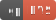

# SLEXIP

***Note: this project is currently in a conceptual phase - it is just an idea. No interpreter nor compiler have been made yet. Suggestions and requests to the specifications are welcome and encouraged. Please submit ideas/feedback/suggestions as [issues](https://github.com/jedSavage/Slexip/issues).***

SLEXIP is a low level programming language inspired by [Piet](http://www.dangermouse.net/esoteric/piet.html) and the [6502 microprocessor](http://www.6502.org). It is not as esoteric as Piet is but it does represents code visually as pixels and allows the execution of code in different directions across the image.

## Program Data Representation

Programs for SLEXIP are written using GIF (index) images. The GIF should contain 256 indices/colors and can be any size up to the maximum limited by GIF standard (65535 x 65535); however, only the first 64k pixels are addressable. The colors chosen for each index do not matter for program execution but can be modified by the program during execution.

SLEXIP uses the image as memory in addition to program data. As the program runs, altering data in memory directly alters the image. There is no console output - altering memory is the standard way of outputting data in SLEXIP.

## Numerical Representation

Throughout this document a `$` character before any value denotes hexadecimal. For decimal values no sybmol will be used (`$1F` vs `31`) and binary values will be repreented with a postfix `b` (e.g. `00110110b`).

## Memory

Pixels are addressable using 2-byte words. The first pixel (pixel index 0) is located at `$0000`. Pixel addresses increase by 1 running front left to right. Addresses wrap around to the next line of pixels. In a 10x10 image, the last pixel on the 3rd line is `$001D`; the 1st pixel on the 4th line is `$001E`; and the last pixel on the last line is `$0063`.

Each pixel can represent a value from `0` to `255` (1-byte). This value also denotes the color index which that pixel should be displayed with. Operators are 1-byte long and Memory addresses are 2-bytes (16-bits) long. Some operators do not require additional data (operands), others may require a value and/or memory address which will be fetched from the pixel(s) following the operator. The combination of operator and operand is an Instruction. For example: `$00` `$42` `$04` `$B5` is a 4-byte instruction that copies (operator `$00` or `CVM`) the value of `$42` into memory address `$04B5`. 

## Program Initialization.

After loading a program (image) into memory, the interpreter caches the values contained in the first 18 pixel locations. These pixels contain **pointers** to various memory addresses that will be used by the interpreter. These pixels can be changed immediately upon program execution as the values are cached before any code is executed. Since memory addresses are 16-bits wide, each pointer takes up 2 pixels. The only way to change the cached locations after initialization is to execute a reset (`$FF` or `RST`) operator. Note that the values in these locations are **pointers** to memory addresses not the memory addresses themselves (unless of course they point to themselves).

Once these pointers are cached, the interpreter beings executing code starting the the address stored in the Program Counter (PC).

### Initialization Pointers

####  - Clock-Speed Register Initialization Pointer

The first pixel in the image contains the memory location of the clock-speed register (CS-Register).  This is a 24-bit register that the interpreter sets its speed by. A value of `0` halts program execution (if interpreter has debugging capabilities, manual stepping can be done). A value of 1 means to evaluate 1 pixel per second (useful for debugging). A value of `60` means to step through 60 pixels per second (60hz). Max value is `16777215` (`$FFFFFF`) or approx 16.7mhz. The value at the location pointed to can be changed during program execution to change interpreter speed.

####  - Stack-Pointer Initialization Pointer

This pixel contains the memory location of the stack-pointer (SP). The SP is a 16-bit pointer containing the memory location of the top of the stack. The stack can be relocated during code execution by changing the values at the SP. The stack grows backwards: when a value is pushed to the stack, the pointer value decrements by one; when a value is popped from the stack the pointer value is increased by one.

####  - Input-Key Register Initialization Pointer

This pixel contains the memory location of the Input-Key Register (IK-Register) - an 8-bit register whose lower 7-bits contain ascii key code of the last key pressed. Bit-7 of this register is set when a non-modifier key is pressed down.

####  - Modifier-Key Register Initialization Pointer

This pixel contains the memory location of the Modifier-Key Register (MK-Register). an 8-bit register with the following bits set when the appropriate key is being pressed down. Bits are cleared as soon as the key is released.

|Bit Position|Modifier Key|
|:---:|:---|
|`Bit 0`|Up Arrow|
|`Bit 1`|Down Arrow|
|`Bit 2`|Left Arrow|
|`Bit 3`|Right Arrow|
|`Bit 4`|Shift|
|`Bit 5`|Control|
|`Bit 6`|Alt|
|`Bit 7`|Command|
	
####  - LFSR Initialization Pointer

This pixel contains the memory location of a 16-bit Linear Feedback Shift Register (LFSR). Setting the LFRS to `$0000` turns off the LFSR feature. The LFSR progresses to the next output once every pixel evaluation. Changing the LFSR value to anything other than zero seeds the LFSR with that value.

####  - Program-Counter Initialization Pointer

This pixel contains the memory location of the program-counter (PC). The PC is a 16-bit pointer that contains the memory address of the next operator to be evaluated.

####  - Status/Direction Register Initialization Pointer

This pixel contains the memory location of the status/direction register (SD-Register). Bits 0-3 contain the status flags. Bit-0 is the Carry flag (C), Bit-1 is the Zero flag (Z), Bit-2 is the Overflow flag (V), bit-3 is the Negative flag (N). These flags are changed by operators.

Bits 4-5 of this register contain the direction the program is currently evaluating in. Bits 6 and 7 are unused but can be read from and written to. With the default value of 00, the PC increments by the size of each instruction after evaluation, rolling over at the end of the image.

|Bits 4 & 5|Program Direction|Effect on PC|Additional at Rollover|
|:---:|:---|:---|:---:|
|`00` |Right|`PC` = `PC` + `LEN`|None  |
|`01` |Down |`PC` = `PC` + `CW-Register`       | + `1`|
|`10` |Left |`PC` = `PC` - `LEN`|None  |
|`11` |Up   |`PC` = `PC` - `CW-Register`       | - `1`|

`LEN` = byte-length of instruction (PC Offset Listed in Instruction Reference).

####  - Canvas-Width Register Initialization Pointer

This pixel contains the memory location of the canvas-width Register (CW-Register). The CW-Register holds a 16-bit value representing the width of the canvas in pixels. Changing the value at the CW-Register will dynamically change the width of the canvas. New pixels will be added with a default value of `$EE`. Clipped pixels will be permanently lost. The interpreter will update the image as needed.

####  - Canvas-Height Register Initialization Pointer

This pixel contains the memory location of the canvas-height Register (CH-Register). The CH-Register holds a 16-bit value representing the height of the canvas in pixels. Changing the value at the CH-Register will dynamically change the height of the canvas. New pixels will be added a default values of `$EE`. Clipped pixels will be permanently lost. The interpreter will update the image as needed.

## Memory Addressing Modes
There are seven modes that can be used with operators. Not all modes are available with all operators.

### Implied (IM)
In implied mode, the data and/or memory that the operator works with is implied resulting in single-byte instructions. Status operators, for example, work solely on the bits of the status register.

### Non-Indexed

#### Relative (R)
This mode is only available with branch operators. The number provided to the operator is added to current PC and program execution continues from that address. Only one byte is passed and it is a signed byte. This allows a jump of `-128` to `+127` bytes relative to the current program counter.

#### Direct (D)
Uses the value directly as entered.  Example, using the JMP operator in direct mode, the PC is set to the value provided and program execution continues from that address.

#### Indirect (I)
Fetches the value from the provided memory address, and uses that value with the operator. Example, using the JMP operator in indirect mode: `JMP` `$44` `$02` - fetches the value from memory address `$4402` and sets the PC to that value.

### Indexed

#### Direct Indexed (DX)
The value at the index location is added to the value provided. The sum is then used in the operation.

#### Indexed Indirect (XI)
The value at the index location is added to the memory address provided. The value at the new location is then used in the operation.

#### Indirect Indexed (IX)
The value at the memory location is fetched and the value at the index location is added to it. The sum is then used in the operation.

## Instruction Set:

There are 64 operators. The chart below shows their op-codes. All other opcodes are interpreted as `NOP` instructions. Program Counter offsets listed are based upon the Direction Register bits being set to `00b`. For other direction configurations, see [Direction Register](#pixels-000c-000d---statusdirection-register-initialization-pointer).

### Data Transport operators

`VAL` = value; `MHB`1 = Memory1 High Byte; `MLB`1 = Memory1 Low Byte;  
`IHB` = Index High Byte; `ILB` = Index Low Byte

** - Copy a value into memory.**

|Addressing Mode|Instruction Format|PC Offset|
|---:|:---|:---|
|Direct          |`$40` `VAL` `MHB` `MLB`            |+4|
|Indirect        |`$60` `VAL` `MHB` `MLB`            |+4|
|Direct Indexed  |`$C0` `VAL` `MHB` `MLB` `IHB` `ILB`|+6|
|Indexed Indirect|`$80` `VAL` `MHB` `MLB` `IHB` `ILB`|+6|
|Indirect Indexed|`$A0` `VAL` `MHB` `MLB` `IHB` `ILB`|+6|

Flags Affected: [-Z-N--]

** - Copy from first memory address to the second.**

|Addressing Mode|Instruction Format|PC Offset|
|---:|:---|:---|
|Direct          |`$41` `VAL` `MHB`1 `MLB`1 `MHB`2 `MLB`2            |+6|
|Indirect        |`$61` `VAL` `MHB`1 `MLB`1 `MHB`2 `MLB`2            |+6|
|Direct Indexed  |`$C1` `VAL` `MHB`1 `MLB`1 `MHB`2 `MLB`2 `IHB` `ILB`|+8|
|Indexed Indirect|`$81` `VAL` `MHB`1 `MLB`1 `MHB`2 `MLB`2 `IHB` `ILB`|+8|
|Indirect Indexed|`$A1` `VAL` `MHB`1 `MLB`1 `MHB`2 `MLB`2 `IHB` `ILB`|+8|

Flags Affected: [-Z-N--]

### Arithmetic operators

** - Add (with carry) two memory values, replacing the first location with result. Indexed modes apply to the second memory address.**

|Addressing Mode|Instruction Format|PC Offset|
|---:|:---|:---|
|Direct          |`$42` `MHB`1 `MLB`1 `MHB`2 `MLB`2        |+5|
|Indirect        |`$62` `MHB`1 `MLB`1 `MHB`2 `MLB`2        |+5|
|Direct Indexed  |`$C2` `MHB`1 `MLB`1 `MHB`2 `MLB`2 `IHB` `ILB`|+7|
|Indexed Indirect|`$82` `MHB`1 `MLB`1 `MHB`2 `MLB`2 `IHB` `ILB`|+7|
|Indirect Indexed|`$A2` `MHB`1 `MLB`1 `MHB`2 `MLB`2 `IHB` `ILB`|+7|

Flags Affected: [CZVN--]

** - Subtract (with borrow) two memory values, replacing the first memory location with result. The second memory value gets subtracted from the first. Indexed modes apply to the second memory address.**

|Addressing Mode|Instruction Format|PC Offset|
|---:|:---|:---|
|Direct          |`$43` `MHB`1 `MLB`1 `MHB`2 `MLB`2        |+5|
|Indirect        |`$63` `MHB`1 `MLB`1 `MHB`2 `MLB`2        |+5|
|Direct Indexed  |`$C3` `MHB`1 `MLB`1 `MHB`2 `MLB`2 `IHB` `ILB`|+7|
|Indexed Indirect|`$83` `MHB`1 `MLB`1 `MHB`2 `MLB`2 `IHB` `ILB`|+7|
|Indirect Indexed|`$A3` `MHB`1 `MLB`1 `MHB`2 `MLB`2 `IHB` `ILB`|+7|

Flags Affected: [CZVN--]

** -  Increment memory by one.**

|Addressing Mode|Instruction Format|PC Offset|
|---:|:---|:---|
|Direct          |`$45` `MHB` `MLB`        |+3|
|Direct Indexed  |`$C5` `MHB` `MLB` `IHB` `ILB`|+5|

Flags Affected: [-Z-N--]

** -  Decrement memory by one.**

|Addressing Mode|Instruction Format|PC Offset|
|---:|:---|:---|
|Direct          |`$44` `MHB` `MLB`        |+3|
|Direct Indexed  |`$C4` `MHB` `MLB` `IHB` `ILB`|+5|

Flags Affected: [-Z-N--]

### Status operators

** -  Clear the carry flag.**

|Addressing Mode|Instruction Format|PC Offset|
|---:|:---|:---|
|Implied|`$E0`|+1|

Flags Affected: [C------]

** -  Set the carry flag.**

|Addressing Mode|Instruction Format|PC Offset|
|---:|:---|:---|
|Implied|`$E1`|+1|

Flags Affected: [C------]

** -  Clear overflow flag.**

|Addressing Mode|Instruction Format|PC Offset|
|---:|:---|:---|
|Implied|`$F0`|+1|

Flags Affected: [--V----]

### Logical operators

** -  Logical AND two memory locations, replacing the first memory location with result.**

|Addressing Mode|Instruction Format|PC Offset|
|---:|:---|:---|
|Direct          |`$50` `MHB`1 `MLB`1 `MHB`2 `MLB`2        |+5|
|Direct Indexed  |`$D0` `MHB`1 `MLB`1 `MHB`2 `MLB`2 `IHB` `ILB`|+7|

Flags Affected: [-Z-N--]

** -  Logical OR two memory locations, replacing the first memory location with result.**

|Addressing Mode|Instruction Format|PC Offset|
|---:|:---|:---|
|Direct          |`$51` `MHB`1 `MLB`1 `MHB`2 `MLB`2        |+5|
|Direct Indexed  |`$D1` `MHB`1 `MLB`1 `MHB`2 `MLB`2 `IHB` `ILB`|+7|

Flags Affected: [-Z-N--]

** -  Logical XOR two memory locations, replacing the first memory location with result.**

|Addressing Mode|Instruction Format|PC Offset|
|---:|:---|:---|
|Direct          |`$52` `MHB`1 `MLB`1 `MHB`2 `MLB`2        |+5|
|Direct Indexed  |`$D2` `MHB`1 `MLB`1 `MHB`2 `MLB`2 `IHB` `ILB`|+7|

Flags Affected: [-Z-N--]

** -  Shifts all bits of a memory location left one position. 0 is shifted into bit-0 and the original bit-7 is shifted into the Carry.**

|Addressing Mode|Instruction Format|PC Offset|
|---:|:---|:---|
|Direct          |`$53` `MHB`1 `MLB`1 `MHB`2 `MLB`2        |+5|
|Direct Indexed  |`$D3` `MHB`1 `MLB`1 `MHB`2 `MLB`2 `IHB` `ILB`|+7|

Flags Affected: [CZ-N--]

** -  Shifts all bits of a memory location right one position. 0 is shifted into bit-7 and the original bit-0 is shifted into the Carry.**

|Addressing Mode|Instruction Format|PC Offset|
|---:|:---|:---|
|Direct          |`$54` `MHB`1 `MLB`1 `MHB`2 `MLB`2        |+5|
|Direct Indexed  |`$D4` `MHB`1 `MLB`1 `MHB`2 `MLB`2 `IHB` `ILB`|+7|

Flags Affected: [CZ-N--]

** -  Shifts all bits of a memory location left one position. The Carry is shifted into bit 0 and the original bit 7 is shifted into the Carry.**

|Addressing Mode|Instruction Format|PC Offset|
|---:|:---|:---|
|Direct          |`$55` `MHB`1 `MLB`1 `MHB`2 `MLB`2        |+5|
|Direct Indexed  |`$D5` `MHB`1 `MLB`1 `MHB`2 `MLB`2 `IHB` `ILB`|+7|

Flags Affected: [CZ-N--]

** -  Shifts all bits of a memory location right one position. The Carry is shifted into bit 7 and the original bit 0 is shifted into the Carry.**

|Addressing Mode|Instruction Format|PC Offset|
|---:|:---|:---|
|Direct          |`$56` `MHB`1 `MLB`1 `MHB`2 `MLB`2        |+5|
|Direct Indexed  |`$D6` `MHB`1 `MLB`1 `MHB`2 `MLB`2 `IHB` `ILB`|+7|

Flags Affected: [CZ-N--]

### Branch operators

OFS = Offset  (Signed byte)

** -  Branch on carry clear - Branch to address if the carry flag is clear. (Increments the PC by OFS).**

|Addressing Mode|Instruction Format|PC Offset|
|---:|:---|:---|
|Relative          |`$20` OFS|+2|

Flags Affected: [------]

** -  Branch on carry set - Branch if the carry flag is set.**

|Addressing Mode|Instruction Format|PC Offset|
|---:|:---|:---|
|Relative          |`$21` OFS|+2|

Flags Affected: [------]

** -  Branch on non-zero - Branch if the zero flag is clear.**

|Addressing Mode|Instruction Format|PC Offset|
|---:|:---|:---|
|Relative          |`$22` OFS|+2|

Flags Affected: [------]

** -  Branch on zero - Branch if the zero flag is set.**

|Addressing Mode|Instruction Format|PC Offset|
|---:|:---|:---|
|Relative          |`$23` OFS|+2|

Flags Affected: [------]

** -  Branch on positive - Branch if the negative flag is clear.**

|Addressing Mode|Instruction Format|PC Offset|
|---:|:---|:---|
|Relative          |`$24` OFS|+2|

Flags Affected: [------]

** -  Branch on negative - Branch if the negative flag is set.**

|Addressing Mode|Instruction Format|PC Offset|
|---:|:---|:---|
|Relative          |`$25` OFS|+2|

Flags Affected: [------]

** -  Branch on overflow clear - Branch if the overflow flag is clear.**

|Addressing Mode|Instruction Format|PC Offset|
|---:|:---|:---|
|Relative          |`$26` OFS|+2|

Flags Affected: [------]

** -  Branch on overflow set - Branch if the overflow flag is set.**

|Addressing Mode|Instruction Format|PC Offset|
|---:|:---|:---|
|Relative          |`$27` OFS|+2|

Flags Affected: [------]

### Comparison operators

** -  Compare two memory locations. Sets zero flag if values are identical. Sets carry flag if the first memory value is equal to or greater than the second memory value.**

|Addressing Mode|Instruction Format|PC Offset|
|---:|:---|:---|
|Direct          |`$46` `MHB` `MLB`        |+3|
|Indirect        |`$66` `MHB` `MLB`        |+3|
|Direct Indexed  |`$C6` `MHB` `MLB` `IHB` `ILB`|+5|
|Indexed Indirect|`$86` `MHB` `MLB` `IHB` `ILB`|+5|
|Indirect Indexed|`$A6` `MHB` `MLB` `IHB` `ILB`|+5|

Flags Affected: [CZ-N--]

### Program Control

** -  Set PC to new value, altering flow of program.**

|Addressing Mode|Instruction Format|PC Offset|
|---:|:---|:---|
|Direct    |`$5F` `MHB` `MLB`|+3|
|Indirect  |`$6F` `MHB` `MLB`|+3|

Flags Affected: [------]

** -  Jump sub routine. Pushes the address of the next operator to the stack, then sets the PC to a new memory value.**

|Addressing Mode|Instruction Format|PC Offset|
|---:|:---|:---|
|Direct    |`$4F` `MHB` `MLB`|+3|

Flags Affected: [------]

** -  Return from subroutine, pop the stack value into the PC and continues evaluating from there.**

|Addressing Mode|Instruction Format|PC Offset|
|---:|:---|:---|
|Implied    |`$EF`|+1|

Flags Affected: [------]

### Stack operators

** -  Push memory to stack.**

|Addressing Mode|Instruction Format|PC Offset|
|---:|:---|:---|
|Direct    |`$4A` `MHB` `MLB`|+3|

Flags Affected: [-Z-N--]

** -  Push status to stack.**

|Addressing Mode|Instruction Format|PC Offset|
|---:|:---|:---|
|Implied    |`$FA`|+1|

Flags Affected: [------]

** -  Pop from stack into memory locaton.**

|Addressing Mode|Instruction Format|PC Offset|
|---:|:---|:---|
|Direct    |`$4B` `MHB` `MLB`|+3|

Flags Affected: [-Z-N--]

** -  Pop from stack into status register.**

|Addressing Mode|Instruction Format|PC Offset|
|---:|:---|:---|
|Implied    |`$FB`|+1|

Flags Affected: [CZVN--]

### Reset

** -  Reset - Runs the interpreter's initialization routine, resets all cached references to pointers.**

|Addressing Mode|Instruction Format|PC Offset|
|---:|:---|:---|
|Implied|`$FF`|+1|

Flags Affected: [CZVNDD]  

### GIF Index operators

`IND` = Index number; `RVL` = Red value; `GVL` = Green Value; `BVL` = Blue Value.

** -  Index Color Modifier - Instructs the interpreter to change the color of an index.**

|Addressing Mode|Instruction Format|PC Offset|
|---:|:---|:---|
|Direct    |`$5E` `IND` `RVL` `BVL` `GVL`|+5|

Flags Affected: [------]

### Null operators

** -  No operator - Does nothing.**

|Addressing Mode|Instruction Format|PC Offset|
|---:|:---|:---|
|Implied    |All Other Op-Codes|+1|

Flags Affected: [------]

## Operator Evaluation Cycle

1. Operator is fetched from the memory location reference by the `PC`.
2. Depending on the operator, the operands are fetched from the memory following the operand.
3. The full Instruction is evaluated, and any related memory is read from and written to.
4. The flags of the status-register are updated to reflect the operation.
5. The `PC` is incremented/decremented as neccesary depending on `SD-Register` bits `4` and `5`, and the length of the instruction, see [Direction Register](#pixels-000c-000d---statusdirection-register-initialization-pointer).
6. The `LFRS` is cycled the same amount as the instruction length.
7. The `CS-Register` is read and the interpreter speed is adjusted if needed.
8. The `IK-Register` and `MK-Register` are both updated, depending on the keys currently pressed.
9. The `CW-Register ` and `CH-Register` are read and the image size displayed is adjusted if needed.

